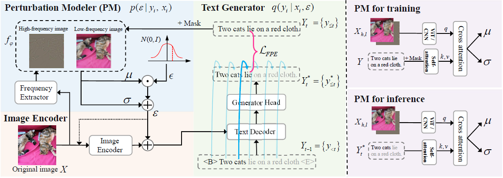
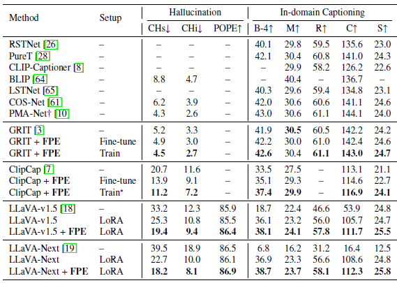
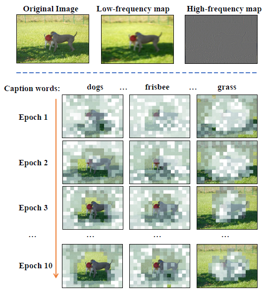
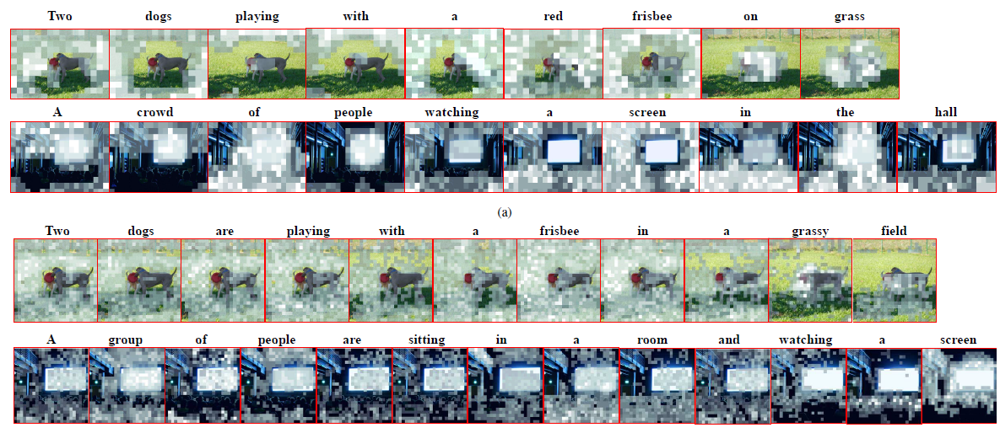

# Frequency Perturbation Entropy: A Method for Mitigating Hallucinations in Image Captioning via Frequency Perturbations

<p align="center">
     <br>
    The framework of Image captioning with Frequency Perturbation Entropy. This framework consists of three main components: a image encoder, a text generator, and a perturbation modeler.
</p>


## 1. Environment setup

Please refer to [meshed-memory-transformer](https://github.com/aimagelab/meshed-memory-transformer).


## 2. Prepare Data

You need to download images from each dataset and locate the images within data folder whose structure should be as follows:
```bash
data
│─ cc3m
│    │─ train_list_filtered_by_0.3.txt   # cc3m training annotation with filtering
│    │─ train_list.txt                   # cc3m training annotation
│    │─ val_list.txt                     # cc3m validation annotation
│    │─ images                           # link to root directory for images
│         │─ train                       # link to directory for training images
│         │─ val                         # link to directory for validation images
│
│─ coco
│    │─ captions_train2017.json          # training annotation
│    │─ captions_val2017.json            # validation annotation
│    │─ captions_karpathy_test.json      # Download on your own. Please check the scripts/download_mscoco.sh
│    │─ images                           # link to root directory for images
│         │─ val2017                     # link to directory for validation images
│         │─ val2014                     # link to directory for karpathy test split
│
│─ nocap
│    │─ val_4500_captions.json           # validation annotation
│    │─ images                           # link to root directory for images
│         │─ validation                  # link to directory for validation images
```
## 3. Evaluation
* Captioning evaluation score are calculate by [coco-caption](https://github.com/tylin/coco-caption) tool.
* Hallucination evaluation score are calculate by [POPE](https://github.com/AoiDragon/POPE/tree/main) and [CHAIR](https://arxiv.org/pdf/1809.02156)

## 4. Training

## 5. Performance

<p align="center">
     <br>
    Performance on hallucination and in-domain captioning for base methods with FPE.
</p>


## 6. Visualization

<p align="center">
     <br>
    The evolution of frequency perturbation when generating specific caption words during training. In each epoch, the perturbation modeler receives the low- and high-frequency maps and generated word sequences to model the frequency perturbation.
</p>
<p align="center">
     <br>
    Visualization of frequency perturbation at each step of caption generation. (a) The inferencing results of GRIT with FPE. (b) The inferencing results of LLaVA-v1.5 with FPE.
</p>


## 7. Citation
Our paper is submited and waiting to review.

## 8. Contact for Issues
Please feel free to contact with [panlz_bit@hotmail.com](panlz_bit@hotmail.com)

## 9. License
This project is licensed under the terms of the [MIT License](./LICENSE).
